# KILO  

A fitness app developed as part of our final year project. The app aims to provide users with a set of workouts that the users can choose from and track their progress to promote physical health. KILO will keep reward its users with achievement badges which can be unlocked by working out with the app and allow users to share their thougths and images with a dedicated social media section. KILO was developed to be used as an extension of a gym allowing uses to pay and avail discounts towards membership fees based on their workout activity.

Features:

- Easy sing-up via Google or other email providers
- Track workout progress
- Get a summary of your workouts
- Track steps and calories burnt
- Post content and images as well as comment on other users' posts
- Delete your posts and comments on other posts
- Perform Yoga with the help of machine learning to track your posture
- View graphs based on your daily steps and calories burnt
- Earn special badges upon completion of workouts
- E-wallet to pay for gym subscriptions and services (under development)

## Tools Used

The app was built entirely on [Flutter](https://flutter.dev/) and runs on services provided by [Firebase](https://firebase.google.com/). The machine learning model runs natively on-device with the help of [PoseNet](https://www.tensorflow.org/lite/examples/pose_estimation/overview)

The following Firebase services were used in this app:

- Firestore: Store product and user data
- Google sign up and email verification
- Storage for user posts and workout animations

## Screenshots

### Intro

 

###Login and Registration

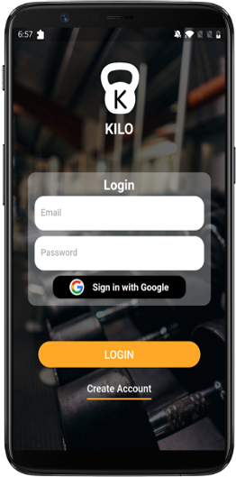  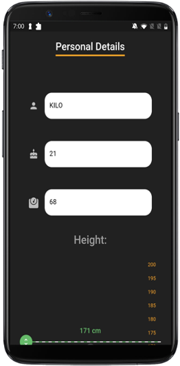 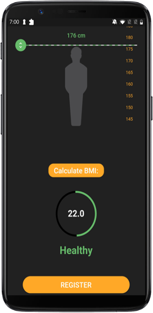

### Dashboard

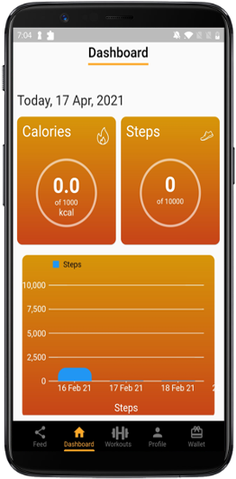

### Feed (Social Media)

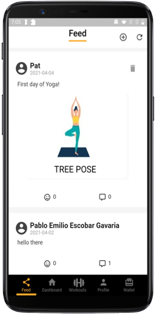 

### Workouts

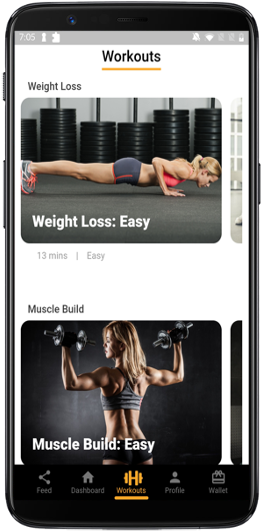 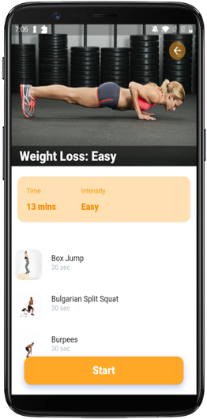 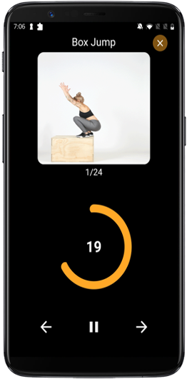 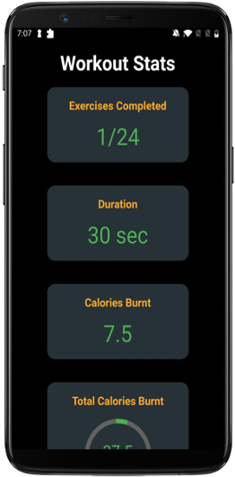

### Yoga

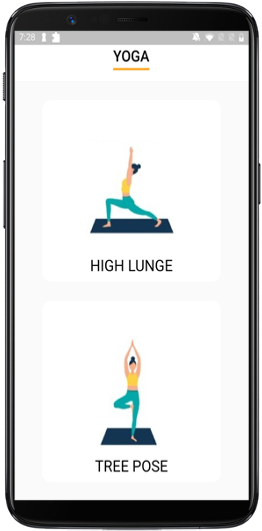

### Profile

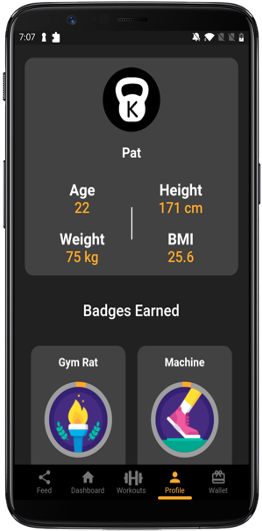 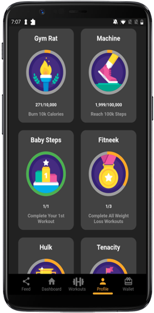

### E-Wallet (Under Development)

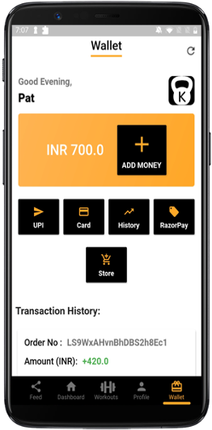 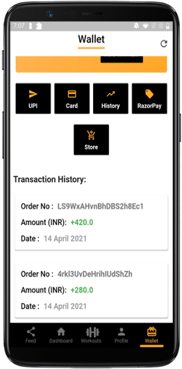
